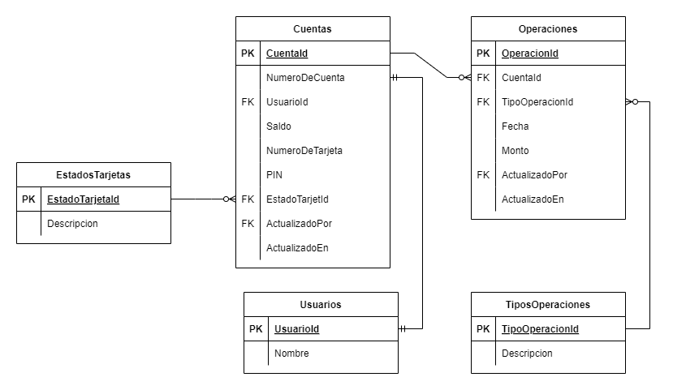

## INTRODUCCION

Aplicación desarrollada para simular un cajero automático (ATM) como parte de un desafío de Backend .NET para Metafar. Permite realizar operaciones básicas como inicio de sesión, consulta de saldo, retiro de efectivo y consultar el historial de operaciones.

---

## DIAGRAMA DE BASE DE DATOS



#### Consideraciones:
- Un Usuario puede tener una única Cuenta.
- Una Cuenta puede estar vinculada a una única Tarjeta.
- Hay un único tipo de Cuenta.
- Hay un único tipo de Tarjeta.
- Estados posibles de una Tarjeta: Activo y bloqueado.
- Tipos de operaciones posibles: Depósito y Extracción.

#### Usuarios:

| Nombre  | NumeroDeTarjeta | PIN |
| --------|-----------------|-----|
|Harry    |1122334455667788 |1234 |
|Hermione |8877665544332211 |4321 |
|Ron      |9955660044773311 |1111 |

---

## CONFIGURACION Y EJECUCION DEL ENTORNO LOCAL

#### El siguiente comando, clona el repositorio desde GitHub


```bash
git clone https://github.com/bnicolas6/metafar-atm-challenge.git
```

<div style="border: 1px solid #2196F3; padding: 10px; background-color: #E3F2FD;">
    <strong>Nota:</strong> Una vez clonado el repositorio, desde la línea de comandos, se debe posicionar en la carpeta raíz del mismo para ejecutar los siguientes comandos.
</div>

---

### BASE DE DATOS

#### Requisitos

- Docker

Por defecto, la aplicación está configurada para interactuar con una base de datos SQL Server que se ejecuta en un contenedor Docker.

#### El siguiente comando crea una Imagen de SQL Server 2022

```bash
docker build -t sqlserver-image .
```

#### El siguiente comando crear un contenedor a partir de la imágen

```bash
docker run -d -p 1433:1433 --name sqlserver-container sqlserver-image
```

#### Verificar el contenedor

```bash
docker ps -a
```

#### El siguiente comando crea la Base de Datos con registros de prueba

```bash
dotnet ef database update --project ./src/Persistence --startup-project ./src/API
```

#### Credenciales


- **Server**: localhost,1433
- **Database**: Metafar_ATM_Challenge
- **User**: sa
- **Password**: password_123

---

### APLICACION

#### El siguiente comando compila y ejecuta la aplicación

```bash
dotnet run --project ./src/API/Metafar.ATM.Challenge.API.csproj
```

---

### PRUEBAS UNITARIAS

#### El siguiente comando ejecuta las pruebas unitarias

```bash
dotnet test ./test/Application.Test/Application.Test.csproj
```

---

## ENDPOINTS

#### Para defecto, la dirección web de Swagger es: 
    
```bash
https://localhost:7013/swagger/index.html
```    
    

La aplicacion expone los siguientes endpoints:

### POST api/login

Requiere el ingreso de un 'numeroDeTarjeta' y un 'Pin', caso de haber coincidencia, retorna un Token JWT que encapsula el respectivo 'numeroDeTarjeta'. En caso contrario, si no hay coincidencia, retorna un mensaje de error. 
Al cuarto intento de acceso fallido de forma consecutiva, la tarjeta vinculada será bloqueada. Por defecto, si 2 intentos de acceso fallidos trascurren en un período menor a 5 minutos, se acumularan. En cambio, si ocurren en un período mayor, no se acumularan. 

#### Ejemplo de Request (Body)

```json
{
  "numeroDeTarjeta": "1122334455667788",
  "pin": "1234"
}
```

---

### GET api/cuentas/saldo

Requiere el ingreso de un token JWT generado por **POST api/login**. A partir del numeroDeTarjeta encapsulado en el token, el endpoint retorna: nombre del usuario, número de cuenta, saldo, y fecha de la última extracción. 

---

### POST api/cuentas/extraer-saldo

Requiere el ingreso de un token JWT generado por **POST api/login** y un monto. A partir del numeroDeTarjeta encapsulado en el token, se realiza una extracción de saldo de la cuenta vinculada según monto ingresado. Si la cuenta posee el saldo suficiente, se realiza la extracción. Si el monto ingresado es superior al saldo de la cuenta, se cancela la extracción y retorna un mensaje de error.

#### Ejemplo de Request (Body)

```json
{
  "monto": "275000.25"
}
```

---

### GET api/operaciones?pageNumber=1

Requiere el ingreso de un token JWT generado por **POST api/login** y opcionalmente un número de página ('pageNumber'). A partir del numeroDeTarjeta encapsulado en el token, retorna un listado paginado de las operaciones realizadas sobre la cuenta vinculada. La cantidad máxima de de operaciones retornadas por consulta es de 10. Si no se ingresa número de página, el valor por defecto es 1.
 
<div style="border: 1px solid #2196F3; padding: 10px; background-color: #E3F2FD;">
    <strong>Nota:</strong> El repositorio cuenta con una collection de Postman para realizar pruebas.
</div>